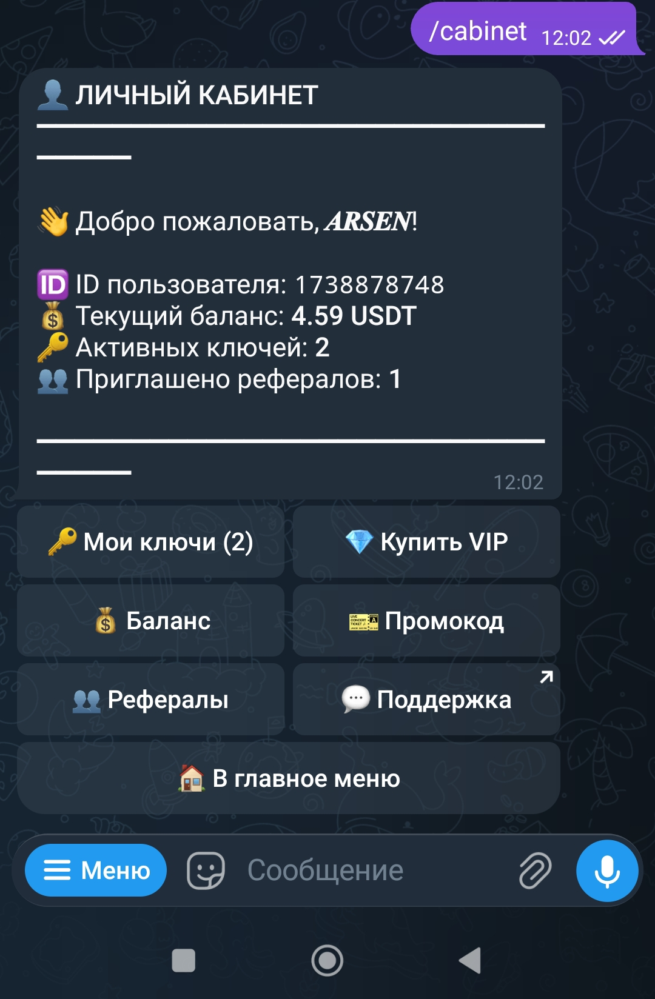
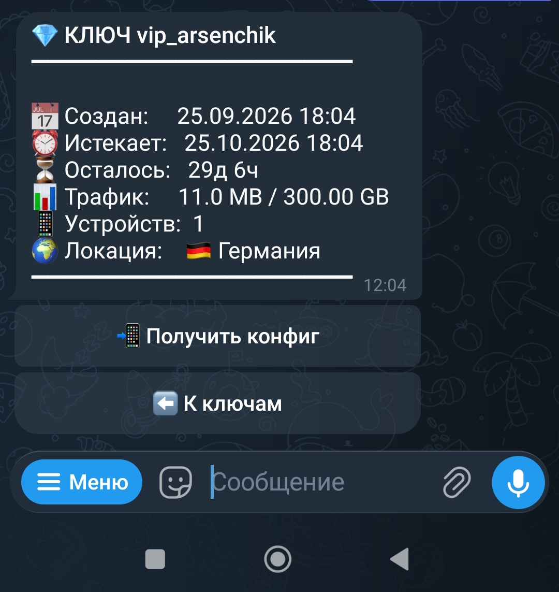
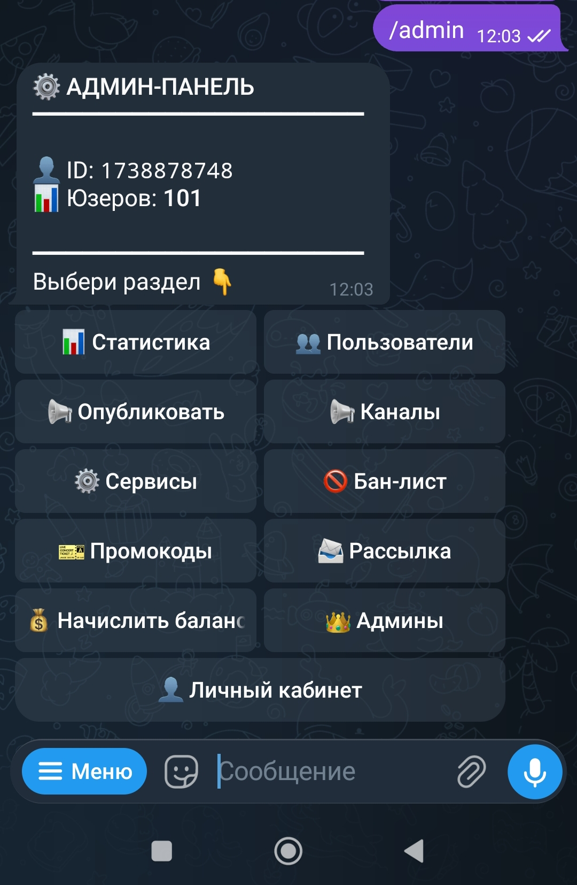
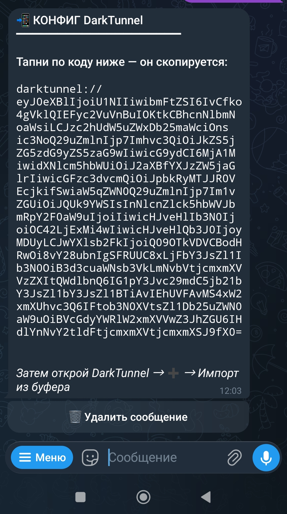

# ⚡ VPN PANEL + Telegram Bot

**Интерактивная консольная панель для администрирования Linux VPN-серверов + Telegram-бот с личным кабинетом**

[📢 Канал](https://t.me/ArsenVipKeys) • [💬 Поддержка](https://t.me/ArsenGuro) • [🚀 Установка](#-установка) • [🎁 Релизы](https://github.com/zotac85/vpn-panel/releases)

---

## ✨ Что это

Готовое решение для продажи SSH-туннелей (SSH over WS, DarkTunnel, HTTP Injector, KPN):

- **VPN-панель** — управление сервером через консоль
- **Telegram-бот** — личный кабинет для клиентов + админ-панель
- **SQLite БД** — юзеры, ключи, баланс, платежи, рефералы
- **Автоматизация** — лимиты, трафик, уведомления, автоочистка

---

## 📸 Скриншоты

### 👤 Личный кабинет

### 🔑 Детали ключа

### ⚙️ Админ-панель

### 📲 Конфиг DarkTunnel

---

## 🎯 Возможности

### 🤖 Telegram-бот — для клиентов
- 👤 **Личный кабинет** — ключи test/VIP, баланс, история операций
- 🎁 **Тест-ключи** — выдача через канал, проверка спонсоров
- 💎 **Покупка VIP** — 3 тарифа (10д/30д/90д), оплата с баланса
- 🎫 **Промокоды** — продление VIP (+дни) или начисление USDT
- 👥 **Рефералка** — +1 USDT и +5 дней к VIP за покупку друга
- 💵 **Пополнение** — заявка админу с указанием суммы
- 📲 **Конфиг DarkTunnel** — генерация darktunnel:// в один тап

### ⚙️ Telegram-бот — для администратора
- 📊 **Статистика** — юзеры, ключи, финансы, топы по балансу/трафику
- 👥 **Пользователи** — отдельно test / VIP / TG-юзеры
- 📢 **Автопостинг** — публикация постов по расписанию
- 📨 **Рассылка** — с превью и отчётом
- 🎫 **Промокоды** — создание, список, удаление
- 💰 **Баланс** — начисление/списание юзерам
- 👑 **Мульти-админ** — несколько админов с полными правами
- 🚫 **Бан-лист** — блокировка нежелательных

### 🖥️ VPN-панель (консоль vpn)
- 🎨 **HTML-баннер** — работает в DarkTunnel / HTTP Injector / KPN
- 👥 **Лимит устройств** — реальная блокировка через PAM pam_exec
- 📶 **Лимит трафика** — подсчёт через iptables, авто-блокировка
- 🛡️ **Безопасность** — UFW, Fail2ban, TCP BBR
- 🌐 **MasterDnsVPN + UDP Custom + WS Proxy**
- 🧹 **Автоочистка** истёкших аккаунтов

---

## 🚀 Установка

**Одной командой на чистом VPS (Ubuntu 20.04+ / Debian 11+):**

    bash <(curl -Ls https://raw.githubusercontent.com/zotac85/vpn-panel/main/install.sh)

**После установки — запуск панели в любой момент:**

    vpn

---

## 📋 Требования

- Ubuntu 20.04+ / Debian 11+
- 1 GB RAM / 10 GB диск
- Root доступ
- Telegram бот от [@BotFather](https://t.me/BotFather)

---

## 🔧 Настройка бота

После установки заполни `/etc/UDPCustom/bot.conf`:

    nano /etc/UDPCustom/bot.conf

Основные параметры:

    BOT_TOKEN="1234567890:ABC..."   # токен от @BotFather
    ADMIN_ID="123456789"            # твой TG ID (@userinfobot)
    SERVER_LOCATION="🇩🇪 Германия"   # локация сервера

Затем в боте:
1. `/addchannel @your_channel` — основной канал
2. `/addchannel @sponsor1` — спонсоры
3. `/addproxy IP` — прокси для DarkTunnel

Перезапуск:

    systemctl restart vpn-tg-bot

---

## 📁 Структура проекта

    vpn-panel/
    ├── install.sh              # Установщик / обновлятор
    ├── vpn                     # Главная точка входа (панель)
    ├── core.sh                 # Общие функции панели
    ├── bot/                    # Telegram-бот
    │   ├── vpn-tg-bot.py       # Основной файл
    │   ├── vpn-traffic-sync.py # Синхронизация трафика
    │   ├── vpn-notify-expiring.py # Уведомления об истечении
    │   └── modules/
    │       ├── db.py           # Работа с SQLite
    │       ├── admin.py        # Мульти-админ
    │       ├── cabinet.py      # Личный кабинет
    │       └── autopost.py     # Автопостинг
    ├── configs/                # Шаблоны конфигов
    ├── modules/                # Модули консольной панели
    └── screenshots/            # Скриншоты

---

## 🗄️ База данных

SQLite: `/etc/UDPCustom/vpn.db`

Таблицы:
- `users` — Telegram-юзеры (баланс, рефералы, ref_code)
- `test_keys` / `vip_keys` — ключи
- `payments` — история операций
- `promo_codes` / `promo_used` — промокоды
- `referrals` — реферальные связи
- `broadcasts` — история рассылок

**Бэкап:**

    cp /etc/UDPCustom/vpn.db /root/backup_$(date +%F).db

---

## 🔄 Обновление

Через панель:

    vpn
    # → пункт 9 (обновить скрипт)

Или вручную:

    cd /root/vpn-panel-sync && git pull origin main

**⚠️ Важно:** обновление **не трогает** `/etc/UDPCustom/*` — все настройки, ключи и БД сохраняются.

---

## 🐛 Troubleshooting

**Бот не отвечает:**

    systemctl status vpn-tg-bot
    tail -50 /var/log/vpn-tg-bot.log

**Ключ не подключается:**

Проверь:
1. Юзер в `/etc/UDPCustom/users.db`
2. Пароль в `/etc/UDPCustom/passwords/<login>`
3. Срок в `/etc/UDPCustom/expire_ts/<login>`
4. WS Proxy: `systemctl status ws-proxy`

**SSH не пускает root после установки** (через VNC хостера):

    sed -i '/check-device-limit-pam/d' /etc/pam.d/sshd
    systemctl restart ssh

---

## 📞 Поддержка

- 💬 Telegram: [@ArsenGuro](https://t.me/ArsenGuro)
- 📢 Канал: [@ArsenVipKeys](https://t.me/ArsenVipKeys)
- 🐛 Issues: [github.com/zotac85/vpn-panel/issues](https://github.com/zotac85/vpn-panel/issues)

---

⭐ **Если проект полезен — поставь звезду!**

Made with ❤️ by [@ArsenGuro](https://t.me/ArsenGuro)

